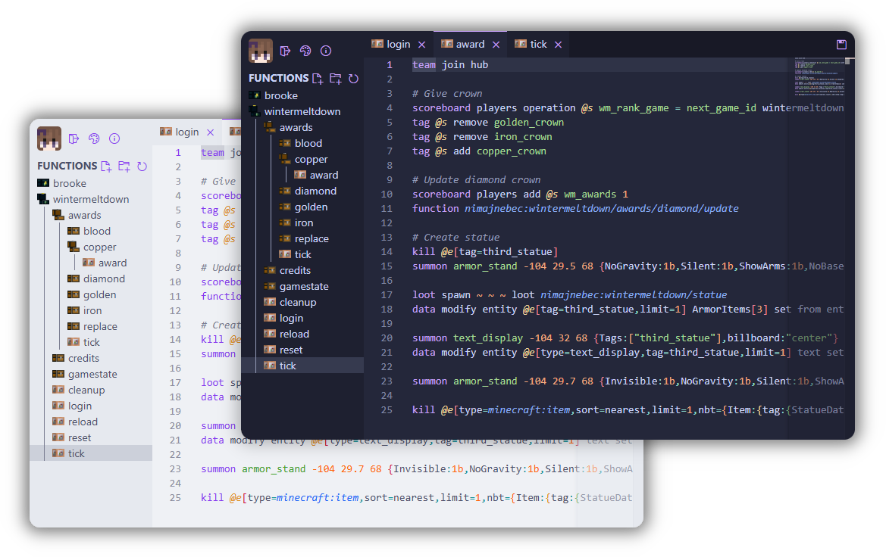

import { Steps } from '@astrojs/starlight/components';

This wiki is designed for players of the Kanoho creative server who want to create exciting new content using the commands and other frameworks provided by the server!

:::note
The [Kanoho Utilities mod](https://github.com/nimahost/kanoho-utilities) and this wiki can be used by anyone and any server, but the content here is specifically tailored for the Kanoho server.
:::

### Where Next?
<Steps>
1. Take a look at one of our guides, like how to [create a usable item](./usable_item)!
2. Browse the reference for more detailed information on specific features!
</Steps>

### Naming Conventions

When creating content for the Kanoho server, we follow a naming convention for any unique identifiers such as tags, scoreboards, and functions.
Simply prefix your identifiers with your username or nickname. For example, `doc_party_popper` or `doc/alcubierre/used`.
When given the option of a namespace like with bossbars or cooldown groups, use the `kanoho` namespace.

### mcfunction-server

Kanoho has [mcfunction-server](https://github.com/brooke-ec/mcfunction-server) installed, which allows you to create and edit functions from your browser.
This is a powerful tool that lets you chain together commands more efficiently and is required for some features of this mod.

To get started, run the `/editor` command in-game!

