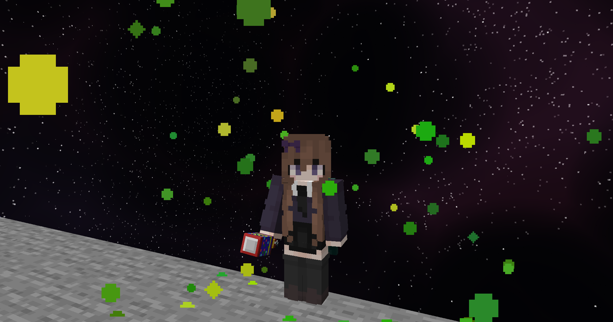

import { Steps } from '@astrojs/starlight/components';

In this guide, you will learn how to create a usable item that performs an action when right-clicked.
Throughout this guide, you will create a party popper item that, when used, will spawn confetti at the player's location. 🎉🎉🎉

### Adding Assets

If you want to completely customise the look and feel of your item, you can add assets to kanoho's resource pack. This step can be skipped if you are happy using a vanilla item.

:::tip
This guide will not go into detail on how to create assets, but we recommend using [Blockbench](https://www.blockbench.net/) for creating models and [Audacity](https://www.audacityteam.org/) for sound effects.
:::

Here is the party popper model we created for this example:


Once you have created your model and sound, you can add them to the resourcepack.

<Steps>
1. Create a fork of the [kanoho resource pack](https://github.com/nimahost/kanoho-resource-pack) and clone it to your local machine.
2. Add your model to the `pack/assets/kanoho/models/item` directory, and any textures to the `pack/assets/kanoho/textures/item` directory.
    Make sure to follow our [naming conventions](./getting_started#naming-conventions).
3. Open the `pack/assets/minecraft/models/item/clay_ball.json` file and add an override for your model.
    For more information, check out the [Minecraft Wiki model definition page](https://minecraft.wiki/w/Items_model_definition).
4. Add your sound files to the `pack/assets/kanoho/sounds/item` directory, and configure them in the `pack/assets/kanoho/sounds.json` file.
    For more information on how you can configure your sounds, check out the [Minecraft Wiki sounds.json page](https://minecraft.wiki/w/Sounds.json).
5. Finally, create a [pull request](https://github.com/nimahost/kanoho-resource-pack/compare) to merge your changes into the main resource pack.
    Once merged, your assets will be available to all users of kanoho!
</Steps>

### Creating the Item

Now that you have your assets ready, you can create the item itself. This involves adding the right [data components](https://minecraft.wiki/w/Data_component_format) to your give command to achieve the functionality you desire.

You start with a regular give command, but add square brackets to the end:

```mcfunction
give @p minecraft:clay_ball[]
```

Inside of these square brackets, you can add the components that define your item:

<Steps>
1. Mark the item as consumable by adding the `minecraft:consumable` component.
    ```mcfunction
    minecraft:consumable={consume_seconds:0,has_consume_particles:false}
    ```
    `consume_seconds` is the time it takes to consume the item, and `has_consume_particles` determines whether particles are shown during that time.

2. Add a cooldown to the item by adding the `minecraft:use_cooldown` component.
    ```mcfunction
    minecraft:use_cooldown={seconds:1,cooldown_group:"kanoho:doc_party_popper"},
    ```
    `seconds` is the duration of the cooldown in seconds, and `cooldown_group` is a unique identifier for the cooldown. Make sure to follow our [naming conventions](./getting_started#naming-conventions) for the cooldown group.

3. Add the `minecraft:custom_model_data` component to use the model you created earlier.
    ```mcfunction
    minecraft:custom_model_data={strings:["doc_party_popper"]}
    ```

4. And finally, add the `minecraft:custom_name` component to give change the item's name.
    ```mcfunction
    minecraft:custom_name='{"color":"yellow","italic":false,"text":"Party Popper"}'
    ```
    By including `"italic":false`, you ensure that the item name is not italicised, which is the default for items with a custom name.
</Steps>

The final give command will like this:

```mcfunction
give @p minecraft:clay_ball[
    minecraft:consumable={consume_seconds:0,has_consume_particles:false},
    minecraft:use_cooldown={seconds:1,cooldown_group:"kanoho:doc_party_popper"},
    minecraft:custom_model_data={strings:["doc_party_popper"]},
    minecraft:custom_name='{"color":"yellow","italic":false,"text":"Party Popper"}'
]
```

For help creating items, we recommend using [mcstacker](https://mcstacker.net/), which is a web-based command generator that can help you create complex commands with ease.

### Adding the Action

Now that you have created the item, you can add the action that it performs when used.

To begin with, you need to create the function that will be called when the item is used.
This function will spawn confetti at the player's location and play the sound you added earlier.

Open mcfunction-server using the `/editor` command and create a new function. Make sure to follow our [naming conventions](./getting_started#naming-conventions) for the function name, such as `doc/party_popper/used`.

Now you can add commands to the function:
<Steps>
1. Spawn "confetti" at the player's location.
    ```mcfunction
    particle minecraft:totem_of_undying ~ ~1.5 ~ 0 0 0 0.75 100
    ```
2. Play the sound you added earlier.
    ```mcfunction
    playsound kanoho:doc.party_popper player
    ```
</Steps>

And finally, you need to tell your item to call this function when used. To do this, add the [Kanoho `on_used` component](../reference/item_components) to your item:

```mcfunction
minecraft:custom_data={kanoho:{on_used:"editor:doc/party_popper/used"}}
```

Notice that Kanoho components are added inside the `minecraft:custom_data` component. This is because Kanoho components are not part of the standard Minecraft data component format.

### Happy Party Popping! 🎉

Your party popper is now ready to use! You can give it to yourself using the command we created earlier:

```mcfunction
give @p minecraft:clay_ball[
    minecraft:consumable={consume_seconds:0,has_consume_particles:false},
    minecraft:use_cooldown={seconds:1,cooldown_group:"kanoho:doc_party_popper"},
    minecraft:custom_model_data={strings:["doc_party_popper"]},
    minecraft:custom_name='{"color":"yellow","italic":false,"text":"Party Popper"}',
    minecraft:custom_data={kanoho:{on_used:"editor:doc/party_popper/used"}}
]
```

#### Tada! 🎉🎉🎉

